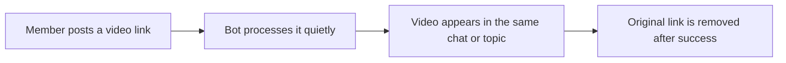

<div align="center">

# Link Downloader Bot for Telegram Groups

### Turn video links into clean Telegram posts — automatically.

A self-hosted Telegram bot for group chats.  
Someone shares a video link, and the bot quietly replaces it with the actual video.

[](https://www.python.org/)
[](https://www.docker.com/)
[](https://github.com/yt-dlp/yt-dlp)
[](LICENSE)

**YouTube · Instagram · TikTok · VK · X / Twitter · Facebook · and many more**

[Install](#quick-start) ·
[How it works](#how-it-works) ·
[Features](#why-this-bot) ·
[Configuration](#configuration) ·
[Contributing](#contributing)

</div>

---

## What does it change?

Without the bot, a group message often looks like this:

```text
https://example.com/video/123456
```

With the bot, the same message becomes a normal Telegram video:

```text
🎬 Native video
🔗 Clickable link to the original source
👤 Name of the person who shared it
```

The group stays cleaner, videos are easier to watch, and nobody has to open a browser or use a separate download bot.

## Why this bot?

### Built for groups, not private chats

There is no need to forward links to another bot, wait for menus, choose formats, and send the result back.

Members simply post links as usual.

### Quiet by design

The bot does not fill the chat with messages like:

- “Downloading…”
- “Please wait…”
- “Processing…”
- “An error occurred…”

Instead, it uses reactions:

| Reaction | Meaning |
|---|---|
| 👀 | The link is being processed |
| 🙈 | Instagram hid or restricted the content from the bot |
| 😴 | Instagram or YouTube temporarily rate-limited the bot |
| 🤷 | The link was checked, but the requested media was not found |
| 👎 | The download failed |
| 👍 | The requested media was posted, but the original link was kept |

When the bot leaves 🙈, 😴, or 👎, a group member can add the same reaction to retry the original link. The bot must
be a group administrator to receive reaction updates. A retry replaces the bot's failure reaction with 👀 and
runs through the normal queue, validation, and download pipeline again.

The 😴 status is protected by a per-platform cooldown shared across all groups. Cached Telegram media is still
delivered immediately, while uncached requests make no Instagram or YouTube request until the cooldown expires.
After expiry, only one request is allowed to probe recovery. Another explicit limit doubles the cooldown up to
the configured maximum. If a chat does not permit 😴, the bot falls back to 👎 instead of silently clearing 👀.

If the link does not contain the requested video or audio, the bot replaces 👀 with 🤷 and leaves the message untouched.
This also covers an Instagram image-only post or a carousel that the extractor explicitly reports as containing no video.

When everything succeeds, the original link can be removed automatically.

### Faster when the same media appears again

If the same link is requested in the same format more than once, the bot can reuse the copy already stored by Telegram. Video and audio have separate cache identities, so one can never be returned in place of the other.

That means:

- no second download;
- no second upload;
- less traffic;
- less waiting;
- lower VPS load.

If several people request the same format at the same time, the bot downloads it only once and delivers it to everyone who requested it.

### Works inside Telegram forum topics

A link posted in a topic is replaced with a video in that same topic. The bot does not move the conversation somewhere else.

### Self-hosted and under your control

You run the bot on your own VPS:

- your Telegram token stays on your server;
- your settings stay on your server;
- you control updates and limits;
- there is no third-party subscription;
- the project is open source.

## Typical use cases

This project is useful for:

- private groups of friends;
- Telegram communities;
- news and discussion groups;
- creator and moderation teams;
- groups where video links are shared frequently;
- self-hosters who do not want to depend on public downloader bots.

## How it works

1. A member posts a video link.
2. The bot marks it with 👀.
3. The video is downloaded and posted silently.
4. The caption keeps a link to the original source and the sender's name.
5. After a successful upload, the original link is removed when the bot has permission.
6. If something fails, the original message remains available.

For a one-time audio request, `/audio <link>` follows the same pipeline but extracts an MP3 and sends it through Telegram's native audio player. The bot chooses the highest standard bitrate from 192 to 32 kbps that fits the configured limit with safety headroom. If the duration is unknown or even 32 kbps cannot fit, the request fails safely instead of uploading an oversized file.



## Why this project is different

| Capability | Link Downloader Bot |
|---|---|
| Made specifically for Telegram groups | ✅ |
| Works without a `/download` command | ✅ |
| Supports one-time `/audio <link>` MP3 downloads | ✅ |
| Does not spam the chat with progress messages | ✅ |
| Keeps videos in the same forum topic | ✅ |
| Remembers previously uploaded videos | ✅ |
| Avoids duplicate simultaneous downloads | ✅ |
| Can delete the original link only after success | ✅ |
| Supports English and Russian | ✅ |
| Runs on your own VPS | ✅ |
| Includes Docker installation and safe updates | ✅ |

## Supported sites

The bot uses [yt-dlp](https://github.com/yt-dlp/yt-dlp), which supports a large number of video websites.

For Telegram video delivery, it prefers the highest-quality H.264 MP4 candidate that fits the configured size limit. When YouTube exposes multiple audio tracks, the source's original track is preferred over automatic dubs even when a dub has a higher bitrate; a translated/default track is used only when no original candidate is available. The same rule applies to `/audio`, which converts the selected source to a size-planned MP3. Every completed file is checked with ffprobe before upload, so an incompatible or partial download is never cached.

Common examples:

- YouTube
- Instagram
- TikTok
- VK
- X / Twitter
- Facebook

Support for individual websites can change when those websites change their APIs or protection systems. The project includes an optional nightly yt-dlp updater to help keep extractors current.

Some websites may require cookies. DRM-protected content is not supported.

## Quick start

### You need

- a Debian or Ubuntu VPS;
- a Telegram bot token from [@BotFather](https://t.me/BotFather);
- permission to add the bot to your group.

Docker and other required packages can be installed automatically by the installer.

### Install

```bash
sudo git clone \
  https://github.com/Avazbek22/LinkDownloaderBotForGroups.git \
  /opt/linkdownloaderbot

sudo bash /opt/linkdownloaderbot/install.sh
```

The installer asks for the Telegram bot token and whether new groups must be approved by the bot owner. It then builds the container, starts the bot, and prepares automatic updates when systemd is available.

To update an existing installation, run the same command again:

```bash
sudo bash /opt/linkdownloaderbot/install.sh
```

Your `.env`, settings, cache metadata, and logs are preserved.

## Telegram setup

Create a bot through [@BotFather](https://t.me/BotFather), then:

1. Open **Bot Settings**.
2. Open **Group Privacy**.
3. Disable Group Privacy.
4. Add the bot to your Telegram group.
5. Grant **Delete messages** permission when you want original links removed.

No other administrator rights are required.

After startup, send:

```text
/help
```

## Basic usage

For normal use, members only need to post a supported link.

```text
https://www.youtube.com/watch?v=...
```

No command is required.

To download one link as MP3 instead of video:

```text
/audio https://www.youtube.com/watch?v=...
```

This is a one-time choice and does not change future downloads. `/audio@BotName <link>` is also accepted in groups. A successful audio request follows the current `DELETE_ORIGINAL` setting just like a video request.

To publish one link without triggering the bot, put `/skip` before it:

```text
/skip https://www.youtube.com/watch?v=...
```

The bot stays completely silent for that message: it does not validate or download the URL, add a reaction, delete the message, or change the sender's personal preference. In groups, Telegram's explicit `/skip@BotName <link>` form works as well.

### Commands

| Command | What it does |
|---|---|
| `/start` | Show the introduction |
| `/help` | Show usage instructions |
| `/audio <link>` | Download one link as MP3 without changing future behavior |
| `/skip <link>` | Leave one link untouched without changing personal settings |
| `/en` | Change the group language to English |
| `/ru` | Change the group language to Russian |
| `/settings` | Show group settings |
| `/delete_original on` | Delete processed links after success |
| `/delete_original off` | Keep original links |

When owner approval is enabled, the owner also gets private `/groups`, `/group <chat_id>`, and `/pending_groups` commands. They are scoped to the owner's private chat and are not published in the global command menu.

Language and group settings can be changed only by group administrators.

### Personal opt-out

A member can disable automatic downloads only for themselves:

```text
@BotName me
```

or:

```text
@BotName я
```

After opting out, that member can still request a download manually:

```text
@BotName https://example.com/video
```

An explicit `/audio <link>` request also works while that member's automatic video downloads are disabled.

Other members are not affected.

## Manual Docker installation

```bash
git clone https://github.com/Avazbek22/LinkDownloaderBotForGroups.git
cd LinkDownloaderBotForGroups

cp .env-example .env
nano .env

docker compose up -d --build
docker compose logs -f --tail=200
```

Only `BOT_TOKEN` is required for a basic setup.

## Configuration

The default settings are suitable for a small private bot.

The most useful options are:

| Variable | Default | Purpose |
|---|---:|---|
| `BOT_TOKEN` | required | Telegram bot token |
| `DEFAULT_LANGUAGE` | `en` | Default language: `en` or `ru` |
| `DELETE_ORIGINAL` | `true` | Remove links after successful delivery |
| `MAX_FILESIZE` | `52428800` | Maximum delivered video or audio size in bytes |
| `WORKERS` | `2` | Simultaneous downloads |
| `UPLOAD_WORKERS` | `2` | Simultaneous Telegram uploads |
| `MAX_QUEUE` | `200` | Number of waiting requests |
| `JOB_TIMEOUT_SECONDS` | `900` | Maximum processing time |
| `MEDIA_CACHE_ENABLED` | `true` | Reuse recent and previously uploaded media |
| `STATUS_REACTIONS` | `true` | Show 👀, 🙈, 😴, 🤷, 👎, and 👍 reactions |
| `GROUP_ACCESS_MODE` | `open` | Use `approval` to block unapproved groups |
| `GROUP_OWNER_USERNAME` | empty | Telegram username used for the initial owner binding |
| `PENDING_GROUP_TTL_HOURS` | `168` | Time before an unapproved group is left |
| `COOKIES_FILE` | empty | Optional cookies file for restricted websites |
| `LOG_LEVEL` | `INFO` | Logging detail level |

See [`.env-example`](.env-example) for all available settings.

### Private group approval

For a private deployment, enable the approval policy:

```env
GROUP_ACCESS_MODE=approval
GROUP_OWNER_USERNAME=your_telegram_username
PENDING_GROUP_TTL_HOURS=168
```

The configured username is used only for the first private contact. Send `/start` to the bot from that account once; the bot then stores the account's stable numeric Telegram ID. A later username change does not remove access, and another account cannot rebind ownership.

When someone adds the bot to a new group:

1. the group is recorded immediately in `data/groups.json`;
2. all link processing is blocked before URL validation, reactions, queues, or website requests;
3. the owner receives a private Approve/Reject request with the member count, the adding user when Telegram provides it, the bot's role, and a compact list of human administrators;
4. the same request message is updated with the final decision, so approval history remains visible after its buttons disappear;
5. rejection makes the bot leave immediately;
6. if the request message cannot be edited or group details cannot be fetched, the decision and access policy still succeed and the owner receives a compact fallback status;
7. failed leave attempts are retried, and the saved request message is updated after a later successful attempt;
8. an unanswered request expires after the configured TTL and the bot leaves.

The group receives one localized waiting-for-approval message. Approval posts a localized confirmation (and the normal usage help on the first welcome). That first welcome reports whether the bot is already an administrator and distinguishes a missing **Delete messages** permission from a missing administrator role. Rejection or expiry posts one localized explanation before the bot leaves. If the bound owner adds the bot personally, that group is approved automatically. Previously approved groups remain approved when re-added unless their access was explicitly revoked with the hard action described below. Notification delivery and failed leave attempts are retried safely in the background.

Use `/groups` in the owner's private chat to see confirmed memberships, their access and runtime state, and a management button for each approved group. `/group <chat_id>` opens the same management card directly, including for a group that no longer appears in the current-membership list. `/pending_groups` shows only requests awaiting a decision. Rejected and departed groups remain in the durable registry and decision-message history but do not clutter `/groups`.

#### Managing an approved group

An approved group has three durable runtime modes:

- **Active** — normal link processing.
- **Soft pause** — the bot stays in the group but silently ignores group messages, commands, mentions, and retry reactions. It sends no pause or resume message to the group and adds no new status reactions. Queued and retryable work for that group is invalidated, and its live processing/retry reactions are cleared on a best-effort basis. The owner can resume processing from the private management card. The pause survives restarts and remains in effect if the bot is removed and re-added.
- **Hard revoke** — after a separate confirmation, processing is blocked immediately, the group receives one localized revocation message, and the bot leaves. A failed leave is retried in the background without repeating that group message. Hard revoke cannot be resumed for the same membership: if a regular member adds the bot again, a fresh approval request is created; if the bound owner adds it, the existing owner auto-approval rule applies.

Every mode change uses a revision check so an old inline button cannot overwrite a newer decision. Runtime changes and a bounded audit history are stored in `data/groups.json`.

Telegram exposes the current member count and administrators, but it does not provide bots with an API that enumerates every regular member or every group retrospectively. The group registry is therefore built from membership updates, observed group messages, existing local chat records, and the optional verified bootstrap described below. Missing member-count or administrator data is shown as unavailable and never blocks an approval request.

#### Enabling approval on an existing bot

Existing trusted groups can be seeded once without hard-coding IDs in the application:

```env
GROUP_BOOTSTRAP_CHAT_IDS=-1001234567890,-1009876543210
```

On startup, every configured ID is checked with Telegram. Only a group where the bot is currently a member or administrator is approved. A `left`, `kicked`, or unverifiable group is never approved. Historical local groups not listed in the bootstrap are discovered when possible but remain blocked and require an owner decision. After a successful first reconciliation the bootstrap value may be removed; the decisions remain in `groups.json`.

### Small VPS profile

For a low-traffic bot on a VPS with limited memory:

```env
WORKERS=1
UPLOAD_WORKERS=1
MAX_QUEUE=30
YTDLP_CONCURRENT_FRAGMENTS=2
DISK_CACHE_MAX_FILES=3
```

<details>
<summary><strong>Advanced configuration</strong></summary>

| Variable | Default | Purpose |
|---|---:|---|
| `LOGS_CHAT_ID` | empty | Optional operator chat for critical notifications |
| `DISK_CACHE_MAX_FILES` | `5` | Maximum recent files kept on disk |
| `DISK_CACHE_TTL_SECONDS` | `300` | Lifetime of recent disk files |
| `FILE_ID_CACHE_MAX_ITEMS` | `500` | Maximum remembered Telegram media entries |
| `FILE_ID_CACHE_TTL_DAYS` | `30` | Lifetime of Telegram media entries |
| `SOURCE_COOLDOWN_INITIAL_SECONDS` | `900` | Initial pause after an explicit Instagram or YouTube rate limit |
| `SOURCE_COOLDOWN_MAX_SECONDS` | `21600` | Maximum exponentially increased source pause |
| `YTDLP_CONCURRENT_FRAGMENTS` | `4` | Parallel download fragments |
| `YTDLP_JS_RUNTIMES` | `node` | JavaScript runtime for yt-dlp |
| `YTDLP_REMOTE_COMPONENTS` | `ejs:github` | Optional yt-dlp components; set an explicit empty value to disable |
| `YTDLP_YOUTUBE_PLAYER_CLIENTS` | `default,android,ios` | YouTube player client fallback chain |
| `YTDLP_YOUTUBE_PLAYER_CLIENT` | (legacy) | Optional single YouTube client override (`default`/`android`/`ios`; `web` remains a default alias) |
| `YTDLP_INSTAGRAM_IMPERSONATE` | `chrome` | Browser impersonation for Instagram |
| `YTDLP_INSTAGRAM_RETRIES` | `8` | Instagram request retries |
| `YTDLP_INSTAGRAM_FRAGMENT_RETRIES` | `8` | Instagram fragment retries |
| `YTDLP_INSTAGRAM_SOCKET_TIMEOUT` | `30` | Instagram timeout in seconds |

</details>

## What happens when media is requested twice?

The bot tries to avoid repeated work at several levels:

1. Equal links requested in the same format at the same time are grouped into one job.
2. Different links that point to the same media are detected after metadata extraction.
3. Recently downloaded files can be reused from the disk cache.
4. Previously uploaded Telegram videos and audio can be sent again using their `file_id`.

Audio and video are deliberately isolated throughout this process. This is especially useful in several groups or active communities, where the same popular media may be shared repeatedly.

## Data and privacy

The bot stores only the data needed to operate:

```text
data/
├── groups.json         # membership, owner binding, access decisions, and runtime modes
├── settings.json       # group language and preferences
├── users.json          # personal opt-out choices
├── state.json          # welcome and migration state
├── media_cache.json    # reusable Telegram media references
└── cache/              # temporary media files
```

Temporary media files are cleaned automatically.

Settings are written safely with temporary files and backups. If a JSON file becomes corrupted, the bot quarantines it and attempts to restore the last valid copy.

## Logs

View container logs:

```bash
docker compose logs -f --tail=200
```

Application logs are also written to:

```text
logs/bot.log
```

They rotate daily. Old files are removed automatically after the retention period.

Sensitive URL query parameters are not written to logs.

<details>
<summary><strong>Limit Docker log size</strong></summary>

Add this to the service in `docker-compose.yml`:

```yaml
logging:
  driver: json-file
  options:
    max-size: "10m"
    max-file: "3"
```

</details>

## Updates and recovery

Video websites change frequently, so yt-dlp may need regular updates.

On systemd-based installations, the installer can enable:

- a nightly yt-dlp update;
- automatic application updates from the installation repository.

Updates are tested before the running bot is replaced. If the new version fails to start correctly, the previous version is restored.

Your token, settings, logs, and persistent data are not replaced.

<details>
<summary><strong>Useful update commands</strong></summary>

```bash
systemctl status linkdownloaderbotforgroups-yt-dlp-update.timer

sudo systemctl start \
  linkdownloaderbotforgroups-yt-dlp-update.service
```

```bash
systemctl status linkdownloaderbotforgroups-deploy.timer

sudo systemctl start \
  linkdownloaderbotforgroups-deploy.service
```

Disable automatic application updates:

```bash
sudo systemctl disable --now \
  linkdownloaderbotforgroups-deploy.timer
```

</details>

## Security

The project rejects links that point to:

- localhost;
- private networks;
- loopback addresses;
- link-local addresses;
- non-public IP destinations;
- URLs containing usernames or passwords.

The Docker container runs with a read-only filesystem where possible and without additional privileges.

Secrets, cookies, downloaded media, and logs are excluded from Git.

For a public or untrusted deployment, host-level firewall rules are still recommended. Application checks reduce risk but cannot replace network isolation in every possible redirect or DNS-rebinding case.

Please report vulnerabilities according to [SECURITY.md](SECURITY.md).

## Troubleshooting

### The bot ignores ordinary group messages

Disable **Group Privacy** in BotFather and restart the bot.

### Videos are posted, but links are not removed

Grant the bot permission to delete messages, or use:

```text
/delete_original on
```

### A website suddenly stops working

Update yt-dlp and inspect the logs:

```bash
sudo systemctl start \
  linkdownloaderbotforgroups-yt-dlp-update.service

docker compose logs --tail=200
```

Some websites may require fresh cookies.

### The bot does not start

```bash
docker compose ps
docker compose logs --tail=200
```

Check that `.env` contains a valid `BOT_TOKEN`.

## Development

Python 3.11 or newer is supported.

```bash
git clone https://github.com/Avazbek22/LinkDownloaderBotForGroups.git
cd LinkDownloaderBotForGroups

python -m venv .venv
source .venv/bin/activate

python -m pip install -r requirements-dev.txt

python -m ruff check .
python -m ruff format --check .
python -m pytest
docker build -t linkdownloaderbotforgroups:test .
```

Tests do not require a real Telegram token or live video websites.

## Contributing

Contributions are welcome.

Good contribution areas include:

- clearer documentation;
- new translations;
- better support for individual video websites;
- Telegram group and topic improvements;
- tests;
- deployment improvements;
- lower-resource operating modes;
- cache and queue improvements.

Before opening a pull request, read [CONTRIBUTING.md](CONTRIBUTING.md).

For bugs and feature requests, use [GitHub Issues](https://github.com/Avazbek22/LinkDownloaderBotForGroups/issues).

## Legal notice

Use this project only for content you are allowed to download and share.

The operator is responsible for complying with:

- website terms;
- copyright law;
- privacy rules;
- Telegram rules;
- local regulations.

This project does not bypass DRM and does not grant rights to third-party content.

## License

Released under the [MIT License](LICENSE).

---

<div align="center">

**A cleaner way to share videos in Telegram groups.**

⭐ Star the repository if the project is useful to you.

</div>
